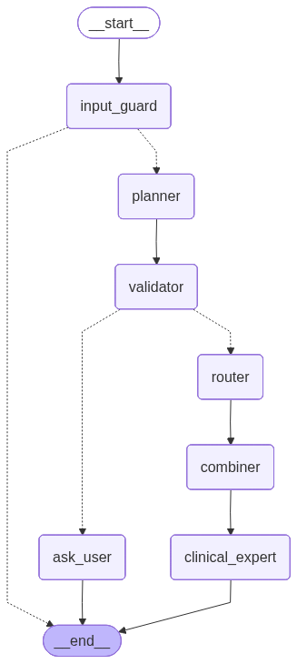

# Agentic RAG — Clinical Chat Agent

A LangGraph clinical chat agent that answers general clinical questions directly and
prior-authorization (PA) guideline questions via RAG, with sources discovered dynamically
through MCP web-search servers (no documents downloaded/committed ahead of time).

## Graph



| Node | Role |
|---|---|
| `input_guard` | LLM Guard scan (`PromptInjection`, `Toxicity`) — blocks unsafe input before anything else runs. |
| `planner` | Splits the message into sub-queries, tagged `chat` / `rag` / `hybrid`. |
| `validator` | For `rag`/`hybrid` sub-queries, checks the conversation has payer name, code/symptom, and LOB. |
| `ask_user` | If info is missing, asks for it and ends the turn (resumes via memory on the next message). |
| `router` | Runs all sub-queries **concurrently** (`asyncio.gather`) — `chat` → direct LLM, `rag`/`hybrid` → MCP search+fetch → `rag_pipeline`. |
| `combiner` | Merges all sub-query results into one draft answer. |
| `clinical_expert` | Decides a normal answer vs. a prior-auth decision tree (per `DT_SKILL.md`). |

Regenerate the diagram after changing `src/workflow.py`:

```bash
uv run python -c "
from config import llm
from src.workflow import build_graph
graph = build_graph(llm, dt_skill_text=open('DT_SKILL.md').read())
graph.get_graph().draw_mermaid_png(output_file_path='graph.png')
"
```

## Architecture

```
src/
├── ingestion.py    # URL + PDF + raw-text loading
├── chunking.py     # Recursive or semantic chunking
├── vectorstore.py  # Chroma, FAISS, or raw ChromaDB collection
├── retrieval.py    # MMR retrieval (LangChain + custom implementation)
├── reranker.py      # Cross-encoder reranking
├── pipeline.py      # End-to-end RAG pipeline (rag_pipeline tool)
├── state.py         # ClinicalAgentState (LangGraph state schema)
├── guards.py         # LLM Guard input scan
├── mcp_client.py     # Tavily search + fetch MCP client
└── workflow.py       # LangGraph clinical agent graph
config.py              # LLM and embedder initialisation
mcp_config.json         # MCP server definitions (Tavily, fetch)
DT_SKILL.md              # Decision-tree generation skill for clinical_expert
app.py                    # Gradio chat interface (entry point)
```

## Setup

```bash
cp .env.example .env   # fill in your keys
uv venv
uv pip install -r requirements.txt
```

Requires `npx` and `uvx` on `PATH` (used to spawn the Tavily and fetch MCP servers).

## Run

```bash
uv run python app.py
```

To stop: `Ctrl+C`. To restart, run the same command again. First guarded request downloads
the LLM Guard scanner models (one-time latency).

## Data

Place PDF files in the `Data/` folder for the optional PDF-ingestion fallback. They are
gitignored and never committed.

## Configuration

| Variable | Description |
|---|---|
| `OPENAI_API_KEY` | Your OpenAI API key |
| `OPENAI_API_BASE` | API base URL (defaults to OpenAI) |
| `LLM_MODEL` | Chat model name (default: `gpt-4o-mini`) |
| `EMBEDDING_MODEL` | Embedding model name (default: `text-embedding-ada-002`) |
| `TAVILY_API_KEY` | Used by the Tavily MCP server for PA guideline web search |

## Vectorstore options

Pass `store_type` to `rag_pipeline()` or `create_vectorstore()`:

- `"faiss"` — FAISS with HNSW index (default)
- `"chroma"` — LangChain Chroma wrapper (persisted to `./db`)
- anything else — raw ChromaDB collection with custom MMR scoring
